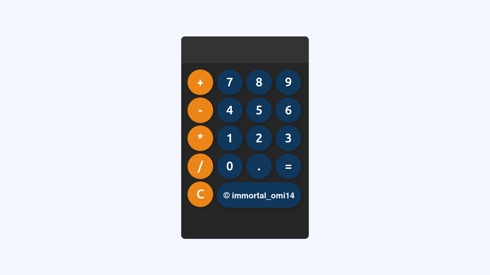

Here's a sample README file for your calculator website:

---

# Calculator Website

A simple and interactive calculator website built with HTML, CSS, and JavaScript. This project offers basic arithmetic operations and aims to provide an easy-to-use interface, making it ideal for quick calculations directly in the browser.

## Features

- **Basic Operations**: Supports addition, subtraction, multiplication, and division.
- **Responsive Design**: Optimized for different screen sizes, making it accessible on mobile and desktop devices.
- **Clear and Reset**: Easily reset calculations and clear the display with dedicated buttons.
- **Error Handling**: Handles invalid inputs and displays error messages where necessary.

## Technologies Used

- **HTML**: Structure and layout of the calculator.
- **CSS**: Styling for a user-friendly and visually appealing design.
- **JavaScript**: Functional logic for performing arithmetic calculations.

## How to Use

1. **Clone the Repository**:
   ```bash
   git clone https://github.com/your-username/calculator-website.git
   ```
2. **Open the `index.html` file** in a web browser to access the calculator.
3. **Start Calculating**:
   - Click on the buttons to input numbers and operators.
   - Use the `=` button to display the result.
   - Use the `C` or `AC` button to clear the input.

## Screenshot



## Contributing

If you'd like to contribute or suggest improvements, feel free to submit a pull request or open an issue.

## License

This project is open-source and available under the MIT License.

---
